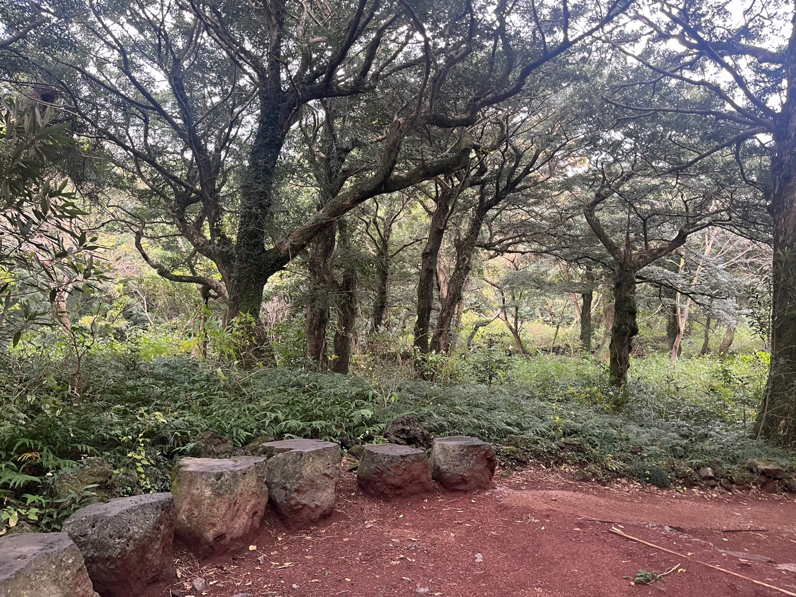

# 2박 3일 나 홀로 제주도 여행 (11.17 ~ 11.19)

리프레시 휴가의 마지막 주말을 그냥 보내기 아쉬웠다.
원래는 템플스테이를 하고 싶었지만 가고 싶던 절이 휴가 동안 예약이 꽉 차있어서 갈 수 없었다.
충동적으로 혼자 제주도에 가서 편하게 쉬고 싶다는 생각이 들었다.
조용히 혼자 돌아다니다가 책을 읽으면서 쉬고 싶었기에 적당한 숙소를 찾아보던 중 [책 닦는 남자](https://m.place.naver.com/accommodation/36209026/home)라는 숙소를 찾았고 다행히 예약할 수 있었다.
숙소와 비행기만 급하게 예약하고 계획 없는 즉흥 여행을 떠나기로 했다.

## 첫째 날

비행기를 타고 제주에 다 왔지만 강풍 때문에 비행기 착륙이 30분 지연되었다.
강풍에 비행기가 흔들릴 때 조금 무서웠다.
제주 공항에 도착하여 밖을 확인해 보니 생각보다 날씨가 더 안 좋았다.

숙소로 이동하던 중 배가 고파 중간에 제주 동문시장에 들러서 허기를 채우기로 했다.
[한일식당](https://naver.me/F6mxnVWU)에서 순댓국을 먹었다.

> 뜨끈하니 아주 맛있었다!

순댓국을 먹고 나오니 날씨가 더 안 좋아졌다.
서 있기도 힘들 정도로 바람이 심하게 불고 비가 내렸다.
날씨를 알아보지 않고 제주도에 온 게 후회됐고 리프레시 마지막 휴가에 뭔 고생인가 싶었다.
집에서 게임이나 하면서 편하게 쉬고 싶다는 생각이 들었다.

얼른 택시를 잡아 숙소로 향했고 게스트하우스 "책 닦는 남자"에 도착했다.

숙소에는 만화책, 소설책 등 다양한 책들이 있었다. 아늑하고 좋았다

기타가 놓여있는 이 방에서는 누워서 책을 볼 수 도 있었다.
아직 다 읽지 못한 책을 집에서 가져왔기 때문에 오늘은 가져온 책을 읽기로 했다.

> 히가시노 게이고의 허상의 어릿광대

추리소설인데 물리학자와 형사가 같이 여러 사건을 해결하는 이야기이다. 꽤 재밌다.

## 둘째 날

날씨가 조금 풀렸다. 바람이 많이 불고 춥긴 했지만 비가 내리진 않아서 다행이었다.

풀린 날씨를 보니 여행 오기 잘했다는 생각이 들었다.

간단하게 아침을 먹기 위해 카페를 찾았다. 숙소에서 걸어서 갈 수 있는 거리에 [비수기 애호가](https://www.instagram.com/slowseasonlover/)라는 카페가 있었다.
카페에 가서 커피를 마시면서 오늘 여행 계획을 세우기로 했다.

커피를 마시면서 바닷가를 보며 멍 때렸다. 풍경이 좋아서 그런지 아침부터 카페에 사람이 꽤 있었다.

감쪽 토스트와 아이스 아메리카노를 시켰고 직원분이 귤의 껍질도 먹는 거라고 알려주셨다.
토스트가 바삭하고 귤 향이 좋았다. 맛있었다!!

커피를 마시고 숙소 사장님께 추천받은 [비자림](https://naver.me/5zJofoaA)에 가보기로 했다.
택시를 불러서 비자림으로 향했다.

곧 겨울인데도 비자림은 푸릇푸릇해서 다행이었다.
바람이 많이 부는 날씨였지만 나무들이 막아줘서인지 숲 안은 춥지 않았다.
산림욕을 제대로 즐겼다.
힐링 되는 기분이었다.

시간이 좀 남아서 [제주해녀박물관](https://naver.me/5B1vLwK7)에 가보기로 했다.

원래는 입장료가 있는데 무슨 기념(까먹)으로 무료로 입장할 수 있었다.

과거 제주도 해녀분들이 독립운동에도 힘쓰고 독도 영유권 수호를 위한 활동에 참여하셨다는 점이 인상 깊었다.

관람을 마치고 배가 고파 카레를 먹으러 가기로 했다.
숙소 20분 거리에 [톰톰 카레](https://naver.me/IG6GEc53)라는 카레집으로 향했다.

배불리 먹었다.
